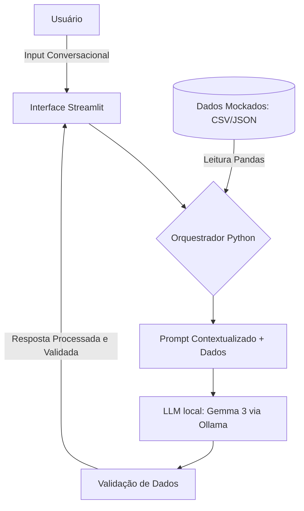

# 🤖 Nexus: Seu Co-piloto de Saúde Financeira

O **Nexus** é um agente financeiro inteligente e proativo projetado para transformar a gestão financeira pessoal de reativa em estratégica. Através da integração de **IA Generativa local (Ollama)** e processamento determinístico de dados com **Pandas**, o Nexus conecta seus gastos diários aos seus sonhos de longo prazo.

---

## 🌟 Funcionalidades Principais

* **Antecipação de Necessidades**: Identifica riscos de estourar orçamentos antes que aconteçam.
* **Análise Visual Moderna**: Dashboards interativos com distribuição de gastos e fluxo de caixa diário.
* **Privacidade Total**: Todo o processamento de dados e inteligência artificial ocorre localmente em sua máquina.
* **Cálculos Determinísticos**: Garante 100% de precisão matemática ao usar Python para processar valores antes da interpretação da IA.
* **Monitoramento de Metas**: Acompanhamento visual de objetivos como "Reserva de Emergência" e "Viagem ao Japão".

---

## 🛠️ Arquitetura do Sistema

O Nexus utiliza uma abordagem de **Arquitetura Híbrida** para evitar alucinações matemáticas comuns em modelos de linguagem.



### Componentes Técnicos:

* **Interface**: Dashboard em Streamlit.
* **LLM**: Ollama rodando o modelo `gemma3:4b`.
* **Base de Conhecimento**: Arquivos `perfil_usuario.json` e `transacoes.csv`.
* **Validação**: Checagem de alucinações e lógica via Pandas.

---

## 🚀 Guia de Desenvolvimento

O projeto foi construído seguindo cinco fases principais:

1. **Idealização e Persona**: Definição do Nexus como um mentor consultivo e analítico.
2. **Estrutura de Dados**: Criação de mocks em JSON e CSV para garantir privacidade e testabilidade.
3. **Orquestrador de Dados**: Implementação da lógica de agregação com Pandas para alimentar a IA com dados prontos.
4. **Integração com IA**: Configuração do System Prompt e diretrizes de resposta para manter o foco financeiro.
5. **Interface Moderna**: Desenvolvimento de UI em modo escuro com métricas e gráficos Plotly.

---

## 📁 Estrutura do Repositório

```text
/
├── data/                          # Dados mockados para o agente
│   ├── perfil_usuario.json        # Perfil, metas e limites
│   └── transacoes.csv             # Histórico de transações
├── docs/                          # Documentação detalhada
│   ├── 01-documentacao-agente.md  # Caso de uso e arquitetura
│   ├── 02-base-conhecimento.md    # Estratégia de integração
│   ├── 03-prompts.md              # Engenharia de prompts
│   ├── 04-metricas.md             # Plano de avaliação
│   └── 05-pitch.md                # Roteiro da apresentação
├── src/                           # Código fonte
│   └── app.py                     # Aplicação principal Streamlit
│   └── requirements.txt               # Dependências do projeto

```

---

## ⚙️ Como Rodar o Projeto

### Pré-requisitos

1. **Python 3.10+** instalado.
2. **Ollama** instalado e rodando o modelo gemma:
```bash
ollama pull gemma3:4b

```


### Instalação

1. Instale as dependências:
```bash
pip install -r src/requirements.txt

```


2. Inicie a aplicação:
```bash
streamlit run src/app.py

```


---

## 📊 Avaliação e Métricas

O Nexus é avaliado com base em quatro pilares fundamentais:

* **Assertividade**: Respostas baseadas nos valores corretos do CSV/JSON.
* **Segurança**: Recusa em responder sobre temas fora do escopo financeiro ou dados inexistentes.
* **Coerência**: Sugestões alinhadas ao perfil de risco "Moderado" do usuário.
* **Proatividade**: Capacidade de alertar sobre limites orçamentários próximos ao estouro.

---

> **Nota**: Este projeto foi desenvolvido como parte de um desafio prático de IA Generativa na DIO.
