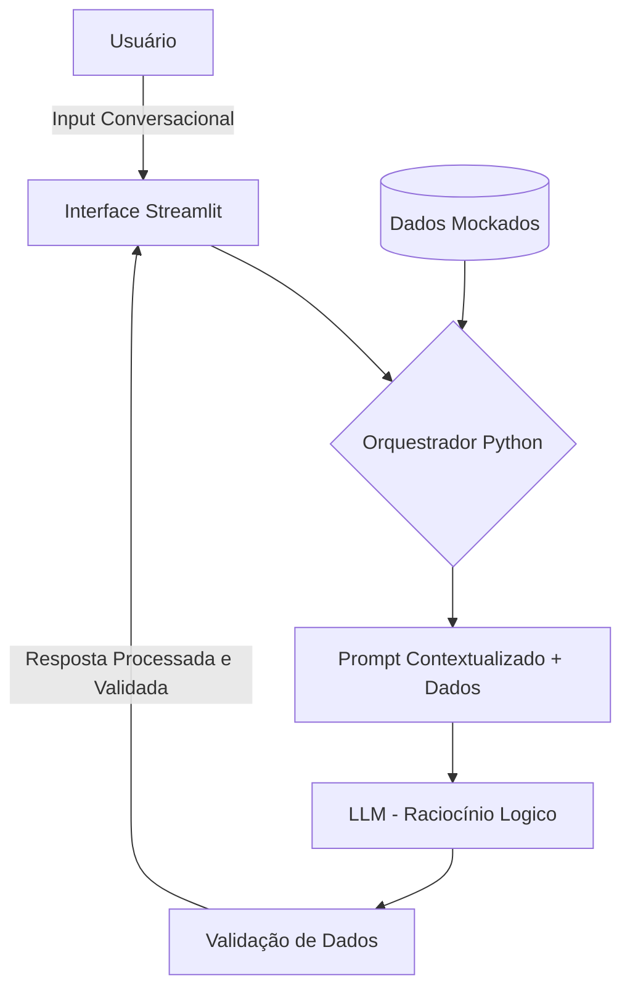

# 🤖 Documentação do Agente: Nexus Financeiro

Este documento descreve a arquitetura e o funcionamento do **Nexus**, um agente financeiro inteligente projetado para transformar dados brutos de planilhas e arquivos JSON em decisões estratégicas proativas.

---

## 1. Caso de Uso

### Problema
A maioria dos usuários lida com as finanças de forma reativa: consultam o saldo apenas quando precisam gastar ou quando recebem alertas de limite atingido. Existe uma dificuldade em conectar os gastos diários (CSV/Extratos) com os objetivos de longo prazo (JSON/Metas).

### Solução
O **Nexus** atua como um "co-piloto" financeiro. Ele consome dados mockados (JSON e CSV) e, em vez de apenas responder "quanto gastei?", ele analisa padrões de consumo e gera insights proativos. Ele cruza o histórico de transações com o perfil do usuário para alertar sobre desvios de rota e sugerir ajustes antes que o orçamento saia do controle.

### Público-Alvo
Jovens profissionais, estudantes e entusiastas de tecnologia que buscam uma interface inteligente para simular e gerir sua saúde financeira sem a complexidade de planilhas manuais.

---

## 2. Persona e Tom de Voz

### Nome do Agente
**Nexus**

### Personalidade
**Consultivo e Analítico.** O Nexus se comporta como um mentor financeiro experiente. Ele não julga os gastos, mas apresenta as consequências lógicas e matemáticas das escolhas do usuário, sempre focado em soluções.

### Tom de Comunicação
**Semi-formal e Acessível.** Evita "economês" denso, mas mantém a precisão técnica. É direto, transparente e encorajador.

### Exemplos de Linguagem
- **Saudação:** "Olá! Analisei seus últimos lançamentos no CSV e notei que sua meta de 'Reserva de Emergência' pode ser atingida 15 dias antes se mantivermos o ritmo atual. Quer ver como?"
- **Confirmação:** "Entendido. Atualizei suas diretrizes de orçamento no sistema. Vou monitorar os próximos lançamentos mockados para garantir que fiquemos dentro do limite."
- **Erro/Limitação:** "Não identifiquei essa categoria nos dados fornecidos. Para manter a precisão, você poderia me informar se este gasto pertence a 'Lazer' ou 'Educação'?"

---

## 3. Arquitetura

### Fluxo de Dados
O sistema utiliza arquivos locais como fonte da verdade, garantindo que a IA não invente saldos ou transações.

### Componentes

| Componente | Descrição |
|------------|-----------|
| Interface | Dashboard em Streamlit para chat e visualização de dados |
| LLM | Ollama (local) |
| Base de Conhecimento | JSON/CSV com dados mockados |
| Validação | Checagem de alucinações |

---

## Segurança e Anti-Alucinação

### Estratégias Adotadas

- [X] Grounding em Arquivos: A LLM é instruída a ignorar qualquer conhecimento externo sobre o usuário e focar exclusivamente nos dados contidos nos mocks fornecidos.
- [X] Admissão de Falha: Se um dado solicitado não estiver nos dados do usuário, o agente é programado para dizer "Não encontrei essa informação nos seus registros" em vez de tentar deduzir.
- [X] Cálculos Determinísticos: A IA não faz contas complexas. O Python processa os valores via Pandas/Numpy e entrega o resultado pronto para a IA comentar.

### Limitações Declaradas

- Somente Leitura: O Nexus analisa os mocks, mas não altera os arquivos originais sem permissão explícita em um fluxo de escrita separado.
- Simulação de Mercado: Não prevê variações reais de bolsa de valores.
- Privacidade: Dados sensíveis não são utilizados.
